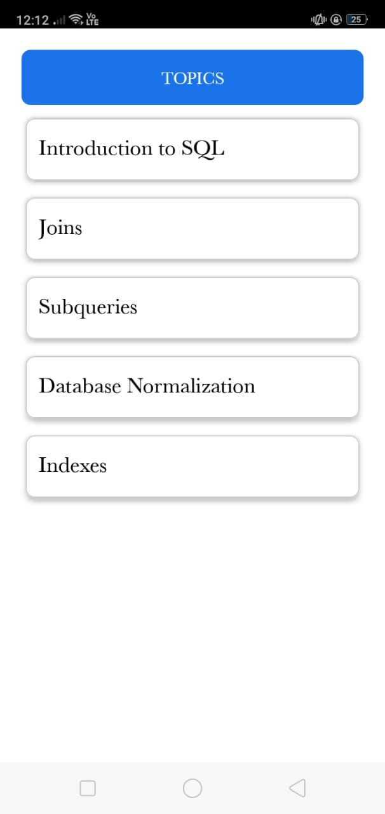
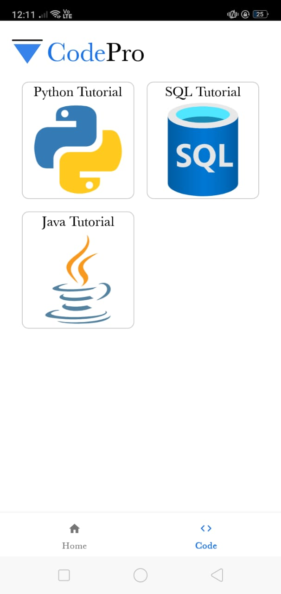

# CodePro App

## 📱 About the App
This Android application provides **technical tutorials** on **Java, SQL, and Python**, along with the latest **news updates across India**. Built using **Android Studio** and **JAVA**, the app is designed to help users learn programming concepts and stay updated with trending news.

## ✨ Features
- 📖 **Coding Tutorials**: Learn Java, SQL, and Python with structured tutorials.
- 📰 **Latest News**: Get real-time news updates from various categories like Technology, Business, Sports, Health, and Entertainment.
- 🌙 **Dark Mode**: Switch between light and dark themes for better readability.

## 🛠️ Technologies Used
- **Android Studio & Java** (for app development)
- **GNEWS API** (for fetching news articles)
- **JSON** (for Retrieving the coding tutorials)

## 📷 Screenshots
<div style="display: flex; justify-content: center;">






</div>

## 🚀 How to Install
1. Clone this repository:
   ```bash
   git clone https://github.com/kishoreinti/CodeProApp.git
   ```
2. Open the project in **Android Studio**.
3. Build and run the project on an emulator or real device.

## 👨‍💻 Contributing
We welcome contributions! If you want to contribute:
1. Fork the repository.
2. Create a new branch (`feature-branch`).
3. Make your changes and commit them.
4. Push the changes and create a pull request.

## 📜 License
This project is licensed under the **MIT License**.

## 📥 Download the APK
[⬇ Download Latest APK](https://github.com/kishoreinti/CodeProApp/releases/latest/download/codepro.apk)


## 📩 Contact
For any issues or suggestions, feel free to reach out:
- 📧 Email: [codepro112.info@gmail.com](mailto:codepro112.info@gmail.com)
- 🔗 GitHub: [kishoreinti](https://github.com/kishoreinti)
- 🌐 Website:([https://codepro1.netlify.app/](https://codepro1.netlify.app/))

---
⚡ **Happy Coding & Stay Updated!** 🚀

